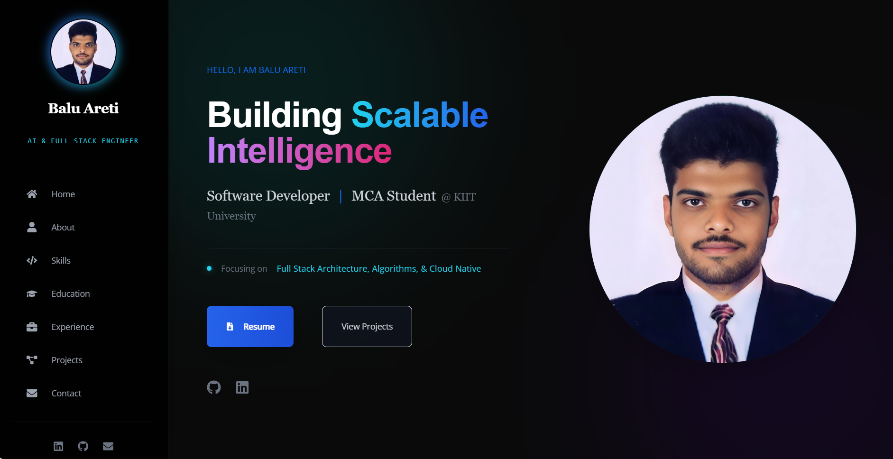
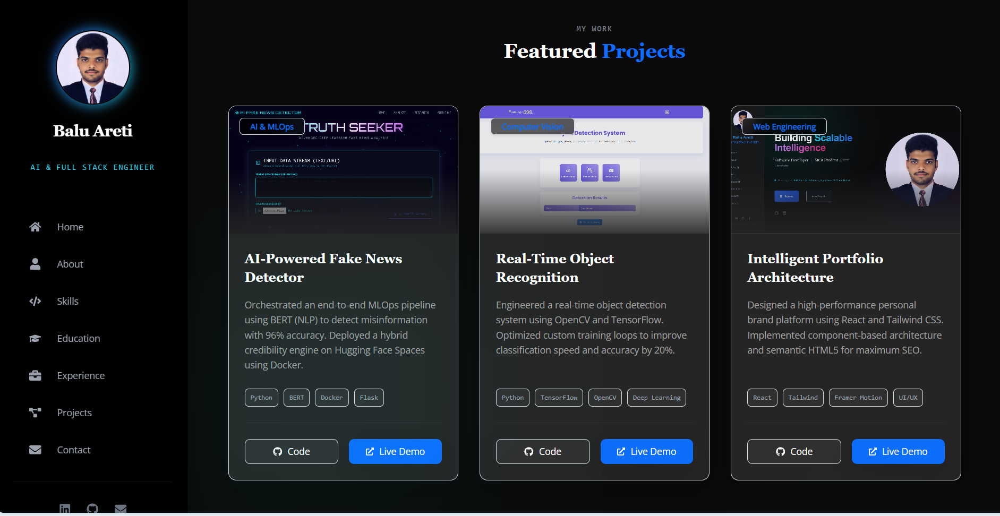
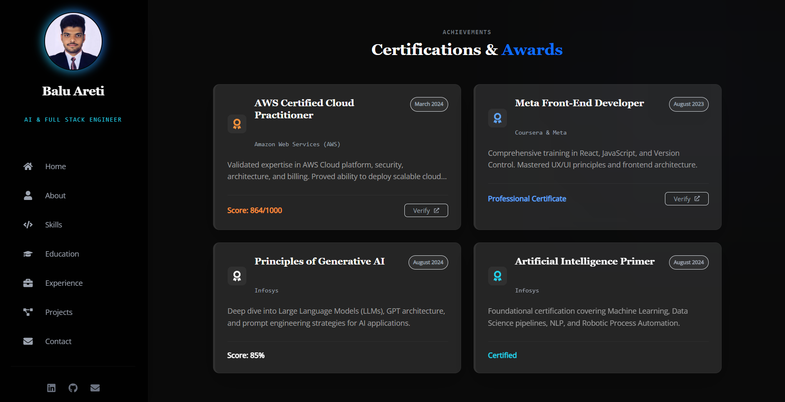

# 🚀 Intelligent Portfolio Architecture

> A high-performance, responsive personal portfolio website built with **React.js**, **Tailwind CSS**, and **Framer Motion**. Designed to showcase my profile as an **AI, Full Stack & Cloud Engineer**.


---

## 🌐 Live Demo
### 👉 [Click Here to View Live Portfolio](https://balu1006.github.io/Balu_Areti-portfolio-react/)

---

## ✨ Key Features

* **⚡ Blazing Fast:** Optimized with **Vite** for instant page loads.
* **🎨 Modern UI/UX:** Dark mode aesthetic with modern gradient-based design.
* **📱 Fully Responsive:** Mobile-first architecture that works on all devices.
* **✨ Smooth Animations:** Rich interactions using **Framer Motion**.
* **📧 Working Contact Form:** Serverless email integration via **Formspree**.
* **📄 Resume Download:** Direct link to download my latest resume.
* **🔍 SEO Optimized:** Basic SEO meta tags added.

---

## 🛠️ Tech Stack

* **Frontend:** React.js (v18)
* **Styling:** Tailwind CSS
* **Animations:** Framer Motion
* **Build Tool:** Vite
* **Icons:** React Icons
* **Deployment:** GitHub Pages

---

## 📸 Screenshots

> *Note: Please add screenshots to a `screenshots` folder in your repository to make these images appear.*

### 🏠 Hero Section
*Modern, clean hero section with responsive layout and professional profile presentation.*


### 📂 Projects Showcase
*Interactive cards displaying **AI (BERT/NLP)**, **Computer Vision**, and **Web Engineering** projects.*


### 🏆 Certifications
*Grid layout verifying professional credentials from **AWS (Cloud)**, **Meta (Frontend)**, and **Infosys (AI)**.*


### 📩 Contact Form
*Fully functional serverless contact form integrated with Formspree.*


---

## 🏃‍♂️ Run Locally

Follow these steps to set up the project locally on your machine.

1.  **Clone the repository**
    ```bash
    git clone https://github.com/balu1006/Balu_Areti-portfolio-react.git
    cd portfolio-react
    ```

2.  **Install dependencies**
    ```bash
    npm install
    ```

3.  **Start local server**
    ```bash
    npm run dev
    ```
    The app will run at `http://localhost:5173/`.

---

## 📬 Contact

**Balu Areti**
*AI & Cloud-Native Full Stack Engineer*

-   📧 Email: [balumahendraareti@gmail.com](mailto:balumahendraareti@gmail.com)
-   🔗 LinkedIn: [linkedin.com/in/balu-areti](https://www.linkedin.com/in/balu-areti-4608ba213/)
-   🐙 GitHub: [github.com/balu1006](https://github.com/balu1006)

---

<p align="center">
  &copy; 2025 Balu Areti. All Rights Reserved.
</p>